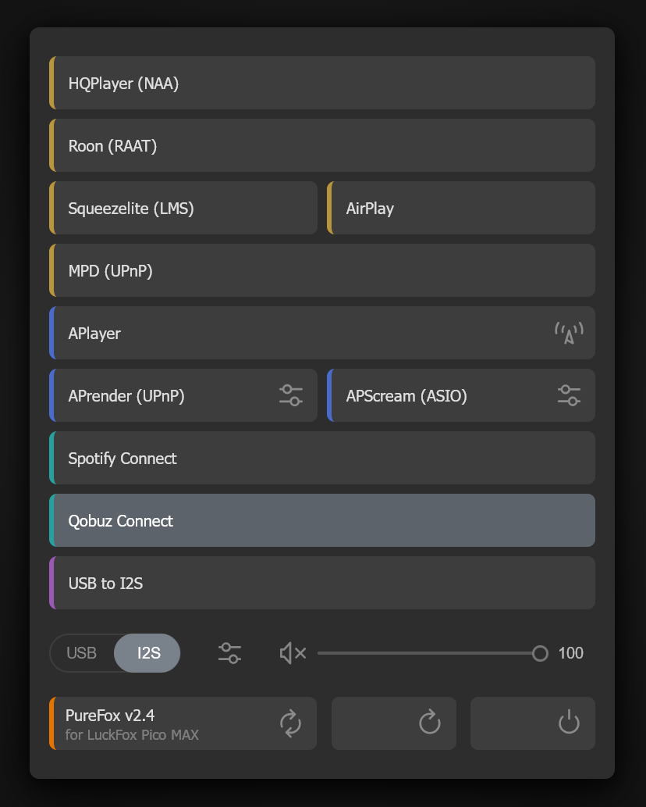
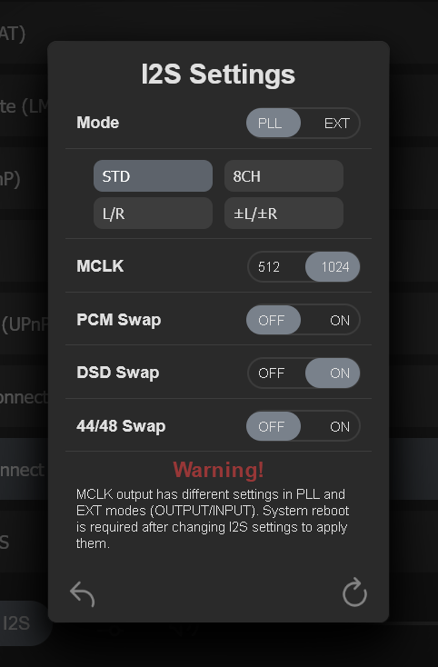

# PureFox

**Network audio endpoint on Luckfox Pico Max / Ultra with external clock support**

## About

PureFox is a firmware for **Luckfox Pico Max** and **Ultra** boards based on Rockchip RV1106, turning them into a high-quality network audio transport with support for:

#### Network Player Mode

- **I2S** output (external clocking EXT / internal PLL synthesizer)
- **USB** output (UAC2)

#### USB Transport Mode

- USB (UAC2) to I2S

#### Supported Audio Standards

- PCM 2ch up to 768 kHz or PCM 8ch up to 192 kHz
- Native DSD (64–512)

## Specifications

| Parameter          | Value                     |
| ------------------ | ------------------------- |
| Processor          | Rockchip RV1106           |
| Linux Kernel       | 6.1                       |
| Power Consumption  | 200–250 mA                |
| Storage            | SPI NOR Flash or eMMC     |
| Power Supply       | 5V via USB Type-C         |
| Outputs            | I2S (EXT/PLL), USB (UAC2) |

## Firmware

### Download

The latest firmware is available at:

- [MEGA](https://mega.nz/fm/v5YwHLBR) — official release
- [Yandex.Disk](https://disk.yandex.ru/d/g8tOCR7uFATj5Q) — mirror

### Installation (via USB)

1. Install drivers from [Luckfox Wiki](https://wiki.luckfox.com/Luckfox-Pico-RV1106/Downloads)
2. Run [RV1106_Toolkit.exe](https://mega.nz/file/ndFiCATS#CG5lF0Nz7JWhmoyrECxeIQDIw3iS5Lv3PZq-MIzJa9c) as Administrator, select **rv1106**
3. Hold the **BOOT** button on the board and connect USB
4. Wait for **Maskrom** to appear in the program
5. Select Download → USB → Search Path → firmware folder
6. Check all files and click **Download**
7. After **Download done**, wait 1 minute, then disconnect the board

### Web Interface

Once booted, the device is available at `http://purefox/` or by IP.  
The web interface supports automatic language switching (English, Russian, Chinese, German, French).  
Unused player buttons can be hidden by swiping left.  
The version button at the bottom is for online firmware updates.

SSH access is enabled: login `root`, password: `purefox`.

## Operating Modes

### I2S

- **EXT** — external master clock
- **PLL** — RV1106 frequency synthesizer. The quality of the internal PLL is surprisingly high. According to numerous subjective tests by audio experts, the internal PLL sound quality rivals that of expensive external clock generators.

### USB (UAC2 Gadget)

- PureCore UAC2 — USB Audio Class 2 emulation
- PCM 2ch up to 768 kHz
- DSD support (DoP and Native via Alt-Setting 2)
- **USB to I2S** mode — USB input → I2S output
- Proprietary drivers required for Native DSD and ASIO. Available for testing upon request. Custom ASIO drivers are in development.

### Output Switching

Via web interface: **I2S ↔ USB** toggle

## Supported Players

- NAA (HQPlayer)
- Roon Ready (RAAT)
- Squeezelite (LMS)
- shairport-sync (AirPlay)
- MPD (UPnP)
- APlayer (web radio only)
- APrender (UPnP)
- APScream (Diretta alternative)
- Spotify Connect (librespot)
- Qobuz Connect
- Tidal Connect (test version only!)

## Repository Branches

| Branch       | Platform                  |
| ------------ | ------------------------- |
| `MAX_6.X`    | Luckfox Pico Max          |
| `ULTRA_6.X`  | Luckfox Pico Ultra (eMMC) |

## Pinout (LuckFox Pico MAX example)

BBB — corresponds to BeagleBone Black pins from the related project [Pure_v2](https://github.com/ppy2/Pure_v2)

## Contacts

- Forum: [PureDSD](https://forum.puredsd.ru/t/luckfox-pico-max-ultra-endpoint-s-vneshnimi-klokami-na-rockchip-rv1106/1172)
